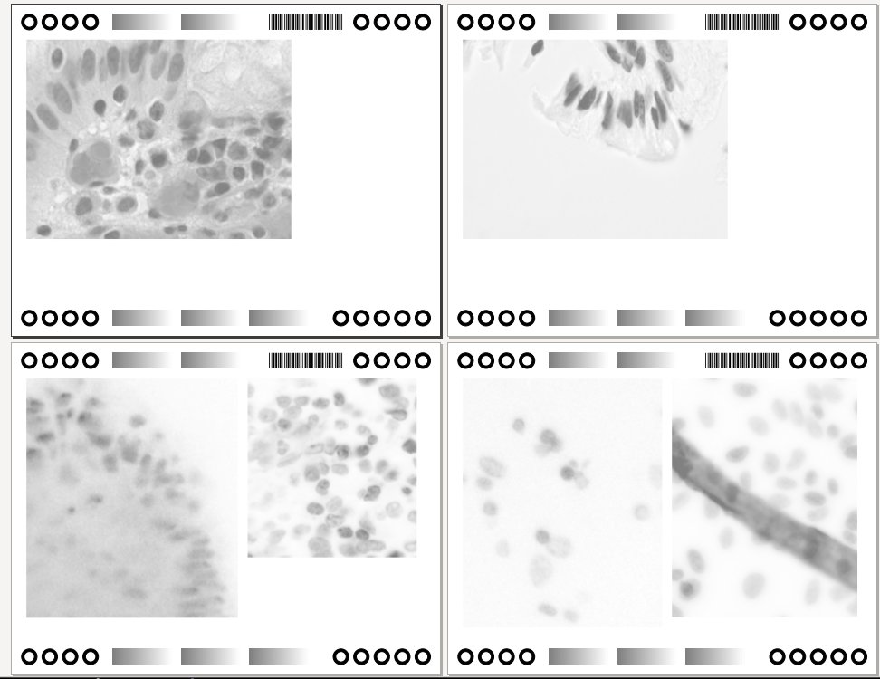
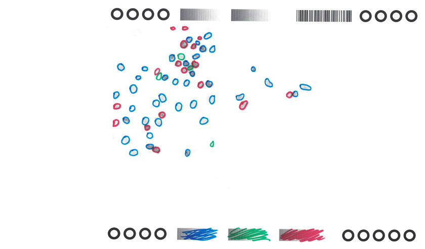
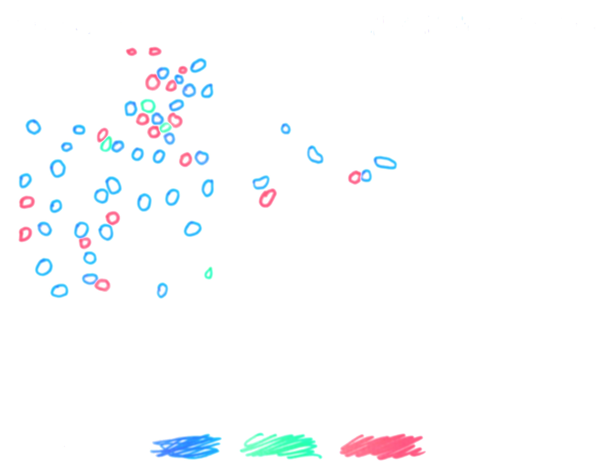

Paperworks - Image Annotation with Paper and Markers
====================================================

# Workflow

## Import images and generate PDF.
	

Checkout source code
```
git clone https://github.com/aaalgo/paperworks
cd paperworks
```
Put images into `paperworks/images` and run
```
# optionally modify defaults.py
./rebuild.sh
```
PDF documents will be generated under `paperworks/jobs`.
The software tries to pack multiple images into single pages
whenever possible.

## Annotate with markers.


## Scan.


Recommended configuration is 24-bit color with resolution = 200.
Put scanned images into `paperworks/scan/*.tiff`.

## Registration.


```
./manage.py scan
```
Some visualizations will be produced in `paperworks/aligned`, and for
each input image there will be a `*.png` file.  The pixel values of the
mask file are 1, 2, ..., each corresponding to a different color used.

## Masks.


# Prerequisites
```
apt-get install zbar-tools
pip install reportlab scikit-learn scikit-image django imageio opencv-python
```

# Tips

- Use red and blue, or red, blue and green.

- Images have to be properly scaled before importing.

# Technical Details

## 2D Bin Packing
```
flow/pack.py
```

## Color Processing
```
flow/color.py
```

